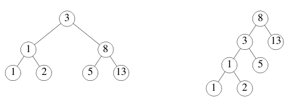

## Goroutines

A *goroutine* is a lightweight thread managed by the Go runtime.

```
go f(x, y, z)
```

starts a new goroutine running

```
f(x, y, z)
```

The evaluation of `f`, `x`, `y`, and `z` happens in the current goroutine and the execution of `f` happens in the new goroutine.

Goroutines run in the same address space, so access to shared memory must be synchronized. The [`sync`](https://go.dev/pkg/sync/) package provides useful primitives, although you won't need them much in Go as there are other primitives. (See the next slide.)

```go
package main

import (
	"fmt"
	"time"
)

func say(s string) {
	for i := 0; i < 5; i++ {
		time.Sleep(100 * time.Millisecond)
		fmt.Println(s)
	}
}

func main() {
	go say("world")
	say("hello")
}
```

## Channels

Channels are a typed conduit through which you can send and receive values with the channel operator, `<-`.

```
ch <- v    // Send v to channel ch.
v := <-ch  // Receive from ch, and
           // assign value to v.
```

(The data flows in the direction of the arrow.)

Like maps and slices, channels must be created before use:

```
ch := make(chan int)
```

By default, sends and receives block until the other side is ready. This allows goroutines to synchronize without explicit locks or condition variables.

The example code sums the numbers in a slice, distributing the work between two goroutines. Once both goroutines have completed their computation, it calculates the final result.

```go
package main

import "fmt"

func sum(s []int, c chan int) {
	sum := 0
	for _, v := range s {
		sum += v
	}
	c <- sum // send sum to c
}

func main() {
	s := []int{7, 2, 8, -9, 4, 0}

	c := make(chan int)
	go sum(s[:len(s)/2], c)
	go sum(s[len(s)/2:], c)
	x, y := <-c, <-c // receive from c

	fmt.Println(x, y, x+y)
}
```

## Buffered Channels

Channels can be *buffered*. Provide the buffer length as the second argument to `make` to initialize a buffered channel:

```
ch := make(chan int, 100)
```

Sends to a buffered channel block only when the buffer is full. Receives block when the buffer is empty.

Modify the example to overfill the buffer and see what happens.

```go
package main

import "fmt"

func main() {
	ch := make(chan int, 2)
	ch <- 1
	ch <- 2
	fmt.Println(<-ch)
	fmt.Println(<-ch)
}
```

## Range and Close

A sender can `close` a channel to indicate that no more values will be sent. Receivers can test whether a channel has been closed by assigning a second parameter to the receive expression: after

```
v, ok := <-ch
```

`ok` is `false` if there are no more values to receive and the channel is closed.

The loop `for i := range c` receives values from the channel repeatedly until it is closed.

**Note:** Only the sender should close a channel, never the receiver. Sending on a closed channel will cause a panic.

**Another note:** Channels aren't like files; you don't usually need to close them. Closing is only necessary when the receiver must be told there are no more values coming, such as to terminate a `range` loop.

```go
package main

import (
	"fmt"
)

func fibonacci(n int, c chan int) {
	x, y := 0, 1
	for i := 0; i < n; i++ {
		c <- x
		x, y = y, x+y
	}
	close(c)
}

func main() {
	c := make(chan int, 10)
	go fibonacci(cap(c), c)
	for i := range c {
		fmt.Println(i)
	}
}
```

## Select

The `select` statement lets a goroutine wait on multiple communication operations.

A `select` blocks until one of its cases can run, then it executes that case. It chooses one at random if multiple are ready.

```go
package main

import "fmt"

func fibonacci(c, quit chan int) {
	x, y := 0, 1
	for {
		select {
		case c <- x:
			x, y = y, x+y
		case <-quit:
			fmt.Println("quit")
			return
		}
	}
}

func main() {
	c := make(chan int)
	quit := make(chan int)
	go func() {
		for i := 0; i < 10; i++ {
			fmt.Println(<-c)
		}
		quit <- 0
	}()
	fibonacci(c, quit)
}
```

## Default Selection

The `default` case in a `select` is run if no other case is ready.

Use a `default` case to try a send or receive without blocking:

```
select {
case i := <-c:
    // use i
default:
    // receiving from c would block
}
```

```go
package main

import (
	"fmt"
	"time"
)

func main() {
	start := time.Now()
	tick := time.Tick(100 * time.Millisecond)
	boom := time.After(500 * time.Millisecond)
	elapsed := func() time.Duration {
		return time.Since(start).Round(time.Millisecond)
	}
	for {
		select {
		case <-tick:
			fmt.Printf("[%6s] tick.\n", elapsed())
		case <-boom:
			fmt.Printf("[%6s] BOOM!\n", elapsed())
			return
		default:
			fmt.Printf("[%6s]     .\n", elapsed())
			time.Sleep(50 * time.Millisecond)
		}
	}
}
```

## Exercise: Equivalent Binary Trees

There can be many different binary trees with the same sequence of values stored in it. For example, here are two binary trees storing the sequence 1, 1, 2, 3, 5, 8, 13.



A function to check whether two binary trees store the same sequence is quite complex in most languages. We'll use Go's concurrency and channels to write a simple solution.

This example uses the `tree` package, which defines the type:

```
type Tree struct {
    Left  *Tree
    Value int
    Right *Tree
}
```

Continue description on [next page](javascript:click('.next-page')).

## Exercise: Equivalent Binary Trees

**1.** Implement the `Walk` function.

**2.** Test the `Walk` function.

The function `tree.New(k)` constructs a randomly-structured (but always sorted) binary tree holding the values `k`, `2k`, `3k`, ..., `10k`.

Create a new channel `ch` and kick off the walker:

```
go Walk(tree.New(1), ch)
```

Then read and print 10 values from the channel. It should be the numbers 1, 2, 3, ..., 10.

**3.** Implement the `Same` function using `Walk` to determine whether `t1` and `t2` store the same values.

**4.** Test the `Same` function.

`Same(tree.New(1), tree.New(1))` should return true, and `Same(tree.New(1), tree.New(2))` should return false.

The documentation for `Tree` can be found [here](https://godoc.org/golang.org/x/tour/tree#Tree).

```go
package main

import "golang.org/x/tour/tree"

// Walk walks the tree t sending all values
// from the tree to the channel ch.
func Walk(t *tree.Tree, ch chan int)

// Same determines whether the trees
// t1 and t2 contain the same values.
func Same(t1, t2 *tree.Tree) bool

func main() {
}
```

## sync.Mutex

We've seen how channels are great for communication among goroutines.

But what if we don't need communication? What if we just want to make sure only one goroutine can access a variable at a time to avoid conflicts?

This concept is called *mutual exclusion*, and the conventional name for the data structure that provides it is *mutex*.

Go's standard library provides mutual exclusion with [`sync.Mutex`](https://go.dev/pkg/sync/#Mutex) and its two methods:

- `Lock`
- `Unlock`

We can define a block of code to be executed in mutual exclusion by surrounding it with a call to `Lock` and `Unlock` as shown on the `Inc` method.

We can also use `defer` to ensure the mutex will be unlocked as in the `Value` method.

```go
package main

import (
	"fmt"
	"sync"
	"time"
)

// SafeCounter is safe to use concurrently.
type SafeCounter struct {
	mu sync.Mutex
	v  map[string]int
}

// Inc increments the counter for the given key.
func (c *SafeCounter) Inc(key string) {
	c.mu.Lock()
	// Lock so only one goroutine at a time can access the map c.v.
	c.v[key]++
	c.mu.Unlock()
}

// Value returns the current value of the counter for the given key.
func (c *SafeCounter) Value(key string) int {
	c.mu.Lock()
	// Lock so only one goroutine at a time can access the map c.v.
	defer c.mu.Unlock()
	return c.v[key]
}

func main() {
	c := SafeCounter{v: make(map[string]int)}
	for i := 0; i < 1000; i++ {
		go c.Inc("somekey")
	}

	time.Sleep(time.Second)
	fmt.Println(c.Value("somekey"))
}
```

## Exercise: Web Crawler

In this exercise you'll use Go's concurrency features to parallelize a web crawler.

Modify the `Crawl` function to fetch URLs in parallel without fetching the same URL twice.

*Hint*: you can keep a cache of the URLs that have been fetched on a map, but maps alone are not safe for concurrent use!

```go
package main

import (
	"fmt"
)

type Fetcher interface {
	// Fetch returns the body of URL and
	// a slice of URLs found on that page.
	Fetch(url string) (body string, urls []string, err error)
}

// Crawl uses fetcher to recursively crawl
// pages starting with url, to a maximum of depth.
func Crawl(url string, depth int, fetcher Fetcher) {
	// TODO: Fetch URLs in parallel.
	// TODO: Don't fetch the same URL twice.
	// This implementation doesn't do either:
	if depth <= 0 {
		return
	}
	body, urls, err := fetcher.Fetch(url)
	if err != nil {
		fmt.Println(err)
		return
	}
	fmt.Printf("found: %s %q\n", url, body)
	for _, u := range urls {
		Crawl(u, depth-1, fetcher)
	}
	return
}

func main() {
	Crawl("https://golang.org/", 4, fetcher)
}

// fakeFetcher is Fetcher that returns canned results.
type fakeFetcher map[string]*fakeResult

type fakeResult struct {
	body string
	urls []string
}

func (f fakeFetcher) Fetch(url string) (string, []string, error) {
	if res, ok := f[url]; ok {
		return res.body, res.urls, nil
	}
	return "", nil, fmt.Errorf("not found: %s", url)
}

// fetcher is a populated fakeFetcher.
var fetcher = fakeFetcher{
	"https://golang.org/": &fakeResult{
		"The Go Programming Language",
		[]string{
			"https://golang.org/pkg/",
			"https://golang.org/cmd/",
		},
	},
	"https://golang.org/pkg/": &fakeResult{
		"Packages",
		[]string{
			"https://golang.org/",
			"https://golang.org/cmd/",
			"https://golang.org/pkg/fmt/",
			"https://golang.org/pkg/os/",
		},
	},
	"https://golang.org/pkg/fmt/": &fakeResult{
		"Package fmt",
		[]string{
			"https://golang.org/",
			"https://golang.org/pkg/",
		},
	},
	"https://golang.org/pkg/os/": &fakeResult{
		"Package os",
		[]string{
			"https://golang.org/",
			"https://golang.org/pkg/",
		},
	},
}
```

## Where to Go from here...

You can get started by [installing Go](https://go.dev/doc/install/).

Once you have Go installed, the [Go Documentation](https://go.dev/doc/) is a great place to continue. It contains references, tutorials, videos, and more.

To learn how to organize and work with Go code, read [How to Write Go Code](https://go.dev/doc/code).

If you need help with the standard library, see the [package reference](https://go.dev/pkg/). For help with the language itself, you might be surprised to find the [Language Spec](https://go.dev/ref/spec) is quite readable.

To further explore Go's concurrency model, watch [Go Concurrency Patterns](https://www.youtube.com/watch?v=f6kdp27TYZs) ([slides](https://go.dev/talks/2012/concurrency.slide)) and [Advanced Go Concurrency Patterns](https://www.youtube.com/watch?v=QDDwwePbDtw) ([slides](https://go.dev/talks/2013/advconc.slide)) and read the [Share Memory by Communicating](https://go.dev/doc/codewalk/sharemem/) codewalk.

To get started writing web applications, watch [A simple programming environment](https://vimeo.com/53221558) ([slides](https://go.dev/talks/2012/simple.slide)) and read the [Writing Web Applications](https://go.dev/doc/articles/wiki/) tutorial.

The [First Class Functions in Go](https://go.dev/doc/codewalk/functions/) codewalk gives an interesting perspective on Go's function types.

The [Go Blog](https://go.dev/blog/) has a large archive of informative Go articles.

Visit [the Go home page](https://go.dev/) for more.

---