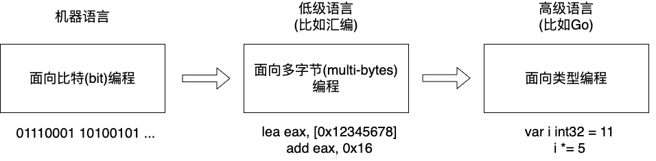
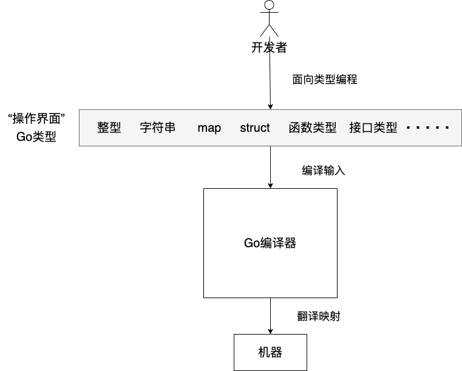
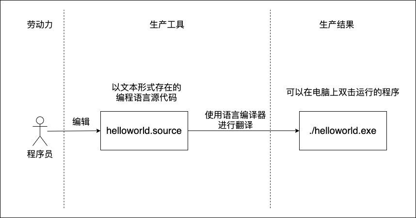
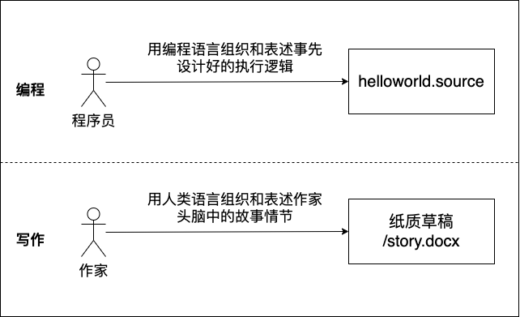
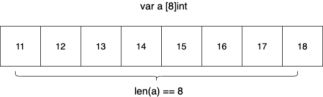
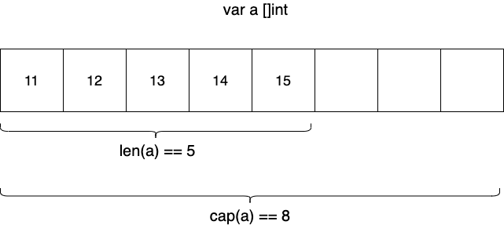

你是否也有过这样的时刻？

你已经用 Go 写了不少代码，项目也能跑起来，但内心深处总有一种挥之不去的“别扭感”。你写的 Go 代码，看起来更像是“带有 Go 语法的 Java/Python”，充斥着你从旧语言带来的思维习惯。代码或许能工作，但它不优雅，不简洁，总感觉“不对劲”。

最近，Twitch 的一位资深机器学习工程师 Melkey 分享了他[从 Go 小白成长为生产级系统开发者的心路历程](https://www.youtube.com/watch?v=wr8gJMj3ODw)。他的故事，完美地诠释了如何突破这个瓶颈，完成从“会写”到“写好”Go 的关键一跃。

在这篇文章中，我们就来解读一下这位工程师的Go专家之路，看看从中可以借鉴到哪些有意义的方法。


### 从“被迫营业”到“感觉不对”的困境

和许多人一样，Melkey 开始学习 Go 并非出于热爱，而是因为工作的“逼迫”。2021年，当他以初级工程师的身份加入 Twitch  时，他还是一个习惯于用 Python 写脚本的“简单小子”，对 Go 一无所知。为了保住这份改变人生的工作，他别无选择，只能硬着头皮学下去。

很快，他熟悉了指针、静态类型和 Go 的基本语法。但问题也随之而来：**他感觉自己的 Go 水平停滞不前，写出的代码“干巴巴的”，缺乏神韵。** 他只是在完成任务，却丝毫没有感受到这门语言的魅力，更谈不上建立起真正的理解和喜爱。

这正是许多 Gopher，尤其是从其他语言转来的开发者，都会遇到的困境：**我们只是在用 Go 的语法，实现其他语言的逻辑。** 我们还没有真正进入 Go 的世界。

### “顿悟”时刻：《Effective Go》带来的思维重塑

改变发生在 Melkey 偶然读到 Go 官方文档中的一篇文章——**《[Effective Go](https://go.dev/doc/effective_go.html)》** 的那一刻。这篇文章里的几段话，像一道闪电，瞬间击穿了他的迷茫：

> “A straightforward translation of a C++ or Java program into Go is  unlikely to produce a satisfactory result—Java programs are written in  Java, not Go.
>
> In other words, to write Go well, it’s important to understand its  properties and idioms. It’s also important to know the established  conventions for programming in Go… so that programs you write will be  easy for other Go programmers to understand.”

这段话的核心思想振聋发聩：**将 C++ 或 Java 程序直接翻译成 Go，不可能得到令人满意的结果。要想写好 Go，就必须理解它的特性和惯用法。**

Melkey 恍然大悟：他之前所做的，正是这种“直接翻译”的笨拙工作。他缺少的，是一次彻底的“思维重塑”——**停止用过去的经验来套用 Go，而是开始真正地用 Go 的思维方式去思考问题。**


### 什么是“Go 的思维方式”？

那么，这种听起来有些玄乎的“Go 思维”究竟是什么？它不是什么神秘的魔法，而是植根于 Go 语言设计中的一系列核心哲学：

1. **崇尚简洁与可读性**.

   Go 厌恶“魔法”。它倾向于用清晰、直白、甚至略显“笨拙”的代码，来换取长期的可读性和可维护性。相比于某些语言中炫技式的语法糖和复杂的隐式行为，Go 鼓励你把事情的来龙去脉写得一清二楚。

2. **组合优于继承**.

   Go 没有类和继承。它通过接口（interface）实现多态，通过结构体嵌入（struct embedding）实现组合。这种方式鼓励开发者构建小而专注的组件，然后像搭乐高一样将它们组合起来，而不是构建庞大而僵硬的继承树。

3. **显式错误处理**.

   `if err != nil` 是 Go 中最常见也最富争议的代码。但它恰恰体现了 Go 的哲学：错误是程序中正常且重要的一部分，必须被显式地处理，而不是通过 try-catch 这样的语法结构被隐藏起来。它强迫你直面每一个可能出错的地方。

4. **并发是语言的一等公民**.

   `Goroutine` 和 `Channel` 不仅仅是两个原生语法元素，它们是一种构建程序的新范式。正如 Rob Pike  所言，“`并发不是并行`”。Go  鼓励你从设计的源头，就把程序看作是一组通过通信来协作的、独立的并发单元，而不是在写完一堆顺序代码后，再思考如何用线程池去“并行化”它。


### 从理论到实践：用项目和资源内化新思维

当然，仅仅理解了这些哲学还远远不够。Melkey 强调，在读完所有文档后，他意识到**“阅读所能做的就这么多了”，必须将新学到的思想付诸实践。**

理论的顿悟，必须通过刻意的项目练习来巩固和内化。下面，就是他亲身走过的、从入门到精通的“四步实战路径”，以及在这条路上为他保驾护航的“精选资源清单”。

###### 一条清晰的实战路径：用四类项目锤炼 Go 思维

- **第一站：HTTP 服务 (从简单到复杂)**.

这是 Go 最核心的应用场景，也是梦开始的地方。从最基础的 CRUD、健康检查 [API 入手](https://tonybai.com/2025/05/23/go-api-design-mcp-sdk)，逐步深入到 [OAuth 认证](https://tonybai.com/2023/12/16/understand-oauth2-by-example)、自定义中间件、[利用 context 包进行请求范围内的值传递等](https://tonybai.com/2022/11/08/understand-go-context-by-example)。这个过程能让你全面掌握构建生产级 Web 后端所需的各项技能。

- **第二站：CLI 工具**.

许多优秀的 Go 开源项目，如 Docker、Kubectl，都是强大的 CLI 工具。通过使用 Cobra、[Bubble T](https://github.com/charmbracelet/bubbletea) 等流行库，去构建自己的命令行应用，你会深刻理解 Go 作为“[云原生时代的 C 语言](https://tonybai.com/2024/08/17/go-the-c-language-of-the-internet-era-come-true)”的工具属性，并学会如何优雅地处理[命令行参数、标志](https://tonybai.com/2023/03/25/the-guide-of-developing-cli-program-in-go)和应用状态。

- **第三站：gRPC 服务**.

当你感觉 HTTP 服务已驾轻就熟时，就该迈向微服务了。学习 gRPC 和 Protocol Buffers，构建服务间的通信。这将迫使你的思维从处理“用户-服务器”交互，转变为处理“服务-服务”间的交互，是成为分布式系统架构师的关键一步。

- **第四站：管道作业与脚本**.

真正的精通，是把一门语言用成“肌肉记忆”。尝试用 Go 替代你过去的脚本语言（如 Python），去编写一些数据处理的管道作业或日常运维脚本，比如批量清洗数据库中的脏数据。这会极大提升你对 Go 标准库的熟练度，让它成为你工具箱里最顺手的那一把。

> 注：Melkey是机器学习工程师，因为他的第四站中，更多是数据处理相关的实战路径。

### 良师益友：来自一线的[精选资源清单](https://tonybai.com/2024/09/10/programmer-mentors-and-their-classic-works).

在这条充满挑战的实践之路上，你不是一个人在战斗。Melkey 也分享了那些曾给予他巨大帮助的“良师益友”。这份清单的宝贵之处在于，它经过了生产一线工程师的真实筛选：

- **Web 后端实战圣经：《Let’s Go Further》 by Alex Edwards**

这本书被誉为 Go Web 开发的经典之作。即便时隔数年，其中的原则和实践依然极具价值。我也极力推荐这本书，Alex 的代码风格非常清晰，对初学者极其友好，能帮你打下坚实的基础。

- **测试驱动开发双璧：《Learn Go with Tests》 & 《Writing an Interpreter in Go》**

前者是优秀的在线教程，手把手教你如何通过测试来学习 Go。后者则通过编写一个解释器的过程，让你在实践中深刻理解测试驱动开发（TDD）的精髓。它们不仅教测试，更在教 Go 语言本身。

- **避坑与最佳实践指南：《100 Go Mistakes and How to Avoid Them》**

这是一本能让你快速提升代码质量的“速查手册”。通过学习别人踩过的坑，你可以少走很多弯路，写出更地道、更健壮的 Go 代码。

## 小结：真正的精通，是一场思维的迁徙


Melkey 的故事告诉我们，精通一门编程语言，从来都不只是学习语法和 API 那么简单。它更像是一场思维的迁徙——你必须愿意放下过去的地图，学习新大陆的规则和文化，并最终成为这片土地上 **地道的“原住民”**。

如果你也感觉自己写的 Go 代码“不对劲”，不妨停下来，问问自己：我是在[用 Go 的方式思考](https://tonybai.com/2017/04/20/go-coding-in-go-way)，还是在用过去的经验翻译？

或许，你的“顿悟”时刻，也正隐藏在重读一遍《Effective Go》的字里行间，或是开启下一个实战项目的决心之中。

你是否也有过类似的“顿悟”时刻？又是哪篇文章、哪个项目或哪位导师，帮助你完成了 Go 思维的重塑？欢迎在评论区分享你的故事。

资料[地址](https://www.youtube.com/watch?v=wr8gJMj3ODw).


# Go并行编程的“第一性原理”：Guy Steele 教你如何“不去想”并行

在多核处理器已成为标配的今天，并行编程能力几乎是每一位后端工程师的必备技能。Go 语言凭借其简洁的 Goroutine 和 Channel  设计，极大地降低了并发编程的门槛，让我们能相对轻松地驾驭并发。但是，写出“能跑”的并发代码，和写出“优雅、高效、可维护”的并行程序之间，往往还隔着一层思维模式的窗户纸。

今天，我想和大家分享一位计算机科学巨匠——Guy L. Steele  Jr.——关于并行编程的深刻洞见。在深入探讨之前，有必要简单介绍一下这位大神：他是 Scheme 语言的共同创造者，Common Lisp  标准的核心定义者，Java 语言设计的关键人物，也是 Sun/Oracle 专门为并行计算设计的 Fortress  语言的领导者。他的见解，源于横跨数十年、从学术到工业的深厚语言设计实践。

他早在多年前（其经典 PPT《How to Think about Parallel Programming—Not!》可以追溯到  2009 年甚至更早）就提出了一些颠覆传统认知，但至今依然闪耀着智慧光芒的核心思想。这些思想，对于我们 Gopher  来说，不啻为并行编程的“第一性原理”，能帮助我们从根本上理解如何更好地设计并行系统。

Steele 的核心论点是什么？一言以蔽之：

> “编写并行应用程序的最佳方式，就是不必去考虑并行本身。”

这听起来是不是有点反直觉？别急，让我们慢慢拆解 Steele 的智慧。

## 并行编程的“敌人”：根深蒂固的“累加器思维”

Steele 犀利地指出，我们过去几十年在顺序编程中养成的许多习惯，正在成为并行编程的障碍。其中，**“累加器 (Accumulators)”模式首当其冲被他判为“BAD”**。

什么是累加器模式？简单来说，就是通过一个共享状态（累加器），不断迭代地用新数据去更新这个状态。一个最经典的例子就是顺序求和：

```go
// 典型的顺序累加求和
func sumSequential(nums []int) int64 {
    var total int64 = 0 // 我就是那个“累加器” total
    for _, n := range nums {
        total += int64(n) // 不断更新自己
    }
    return total
}
```

这段代码再熟悉不过了，对吧？但在 Steele 看来，这种写法是并行编程的“噩梦”。为什么？

- **强烈的顺序依赖：** 每一步的 total 都依赖于上一步的结果。这种串行依赖使得直接将其并行化变得异常困难。如果多个 Goroutine 同时去更新 total，就需要引入锁或其他同步机制，不仅增加了复杂性，还可能因为锁竞争而严重影响性能，甚至违背了并行的初衷。
- **鼓励可变状态与副作用：** 累加器本身就是一个可变状态，操作带有副作用。这在并行环境下是诸多问题的根源。

Steele 甚至略带调侃地说：DO 循环太上世纪五十年代了！… 当你写下 SUM = 0 并开始累加时，你就已经把自己“坑”了。

那么，我们应该如何摆脱这种“累加器思维”的桎梏呢？

## Steele的药方：拥抱“分治”与“结合性”

Steele 提倡的核心思想是 **“分治 (Divide-and-Conquer)”** 和利用操作的 **“代数性质 (Algebraic Properties)”**，尤其是 **“结合性 (Associativity)”**。

1. **分治 (Divide-and-Conquer)：** 将大问题分解成若干个独立的、可以并行处理的子问题。每个子问题独立求解后，再将结果合并。这天然地契合了并行的思想。
2. **结合性 (Associativity)：** 如果一个操作 ⊕ 满足结合律，即 (a ⊕ b) ⊕ c = a ⊕ (b ⊕ c)，那么在合并子问题的结果时，合并的顺序就不重要了。这给予了并行执行极大的“自由度”。例如，加法 + 和乘法 * 都满足结合律。

让我们用 Go 来实践一下这种思想，改造上面的求和函数。

**Go 实践 1：基于 Goroutine 和 Channel 的分块并行求和**

我们可以将数组切分成若干块 (chunk)，每个 Goroutine 负责计算一块的和，最后将各块的结果汇总。

```go
import (
    "runtime"
    "sync"
)

func sumParallelChunks(nums []int, numChunks int) int64 {
    if len(nums) == 0 { return 0 }
    if numChunks <= 0 { numChunks = runtime.NumCPU() } // 默认使用CPU核心数作为块数
    if len(nums) < numChunks { numChunks = len(nums) }

    results := make(chan int64, numChunks)
    chunkSize := (len(nums) + numChunks - 1) / numChunks 

    for i := 0; i < numChunks; i++ {
        start := i * chunkSize
        end := (i + 1) * chunkSize
        if end > len(nums) { end = len(nums) }

        // 每个goroutine处理一个独立的块
        go func(chunk []int) {
            var localSum int64 = 0
            for _, n := range chunk { // 块内部仍然是顺序累加，但这是局部行为
                localSum += int64(n)
            }
            results <- localSum // 将局部结果发送到channel
        }(nums[start:end])
    }

    var total int64 = 0
    for i := 0; i < numChunks; i++ {
        total += <-results // 合并结果，加法是结合的！顺序不重要
    }
    return total
}
```

**Go 实践 2：递归分治的并行求和 (更纯粹地体现分治)**

对于分治思想，递归往往是更自然的表达：

```go
// 辅助函数，保持接口一致性
func sumRecursiveParallelEntry(nums []int) int64 {
    // 设定一个阈值，小于此阈值则顺序计算，避免过多goroutine开销
    const threshold = 1024
    return sumRecursiveParallel(nums, threshold)
}

func sumRecursiveParallel(nums []int, threshold int) int64 {
    if len(nums) == 0 { return 0 }
    if len(nums) < threshold {
        return sumSequential(nums) // 小任务直接顺序计算
    }

    mid := len(nums) / 2

    var sumLeft int64
    var wg sync.WaitGroup
    wg.Add(1) // 我们需要等待左半部分的计算结果
    go func() {
        defer wg.Done()
        sumLeft = sumRecursiveParallel(nums[:mid], threshold)
    }()

    // 右半部分可以在当前goroutine计算，也可以再开一个goroutine
    sumRight := sumRecursiveParallel(nums[mid:], threshold)

    wg.Wait() // 等待左半部分完成

    return sumLeft + sumRight // 合并，加法是结合的
}
```

## 基准测试：并行真的更快吗？

理论归理论，实践是检验真理的唯一标准。我们为上述三个求和函数编写了基准测试，在一个典型的多核开发机上运行（例如，4 核 8 线程的 CPU）。我们使用一个包含 1000 万个整数的切片作为输入。

```go
// benchmark_test.go
package main

import (
    "math/rand"
    "runtime"
    "testing"
    "time"
)

var testNums []int

func init() {
    rand.Seed(time.Now().UnixNano())
    testNums = make([]int, 10000000) // 10 million numbers
    for i := range testNums {
        testNums[i] = rand.Intn(1000)
    }
}

func BenchmarkSumSequential(b *testing.B) {
    for i := 0; i < b.N; i++ {
        sumSequential(testNums)
    }
}

func BenchmarkSumParallelChunks(b *testing.B) {
    numChunks := runtime.NumCPU()
    b.ResetTimer()
    for i := 0; i < b.N; i++ {
        sumParallelChunks(testNums, numChunks)
    }
}

func BenchmarkSumRecursiveParallel(b *testing.B) {
    for i := 0; i < b.N; i++ {
        sumRecursiveParallelEntry(testNums)
    }
}
```

**典型的基准测试结果可能如下 (具体数字会因机器而异)：**

```bash
$go test -bench .
goos: darwin
goarch: amd64
pkg: demo
cpu: Intel(R) Core(TM) i5-8257U CPU @ 1.40GHz
BenchmarkSumSequential-8                 429       2784507 ns/op
BenchmarkSumParallelChunks-8             520       1985197 ns/op
BenchmarkSumRecursiveParallel-8          265       4420254 ns/op
PASS
ok      demo    4.612s
```

从结果可以看出：

- sumSequential 作为基线，但顺序版本的速度并非最慢。
- sumParallelChunks 显著快于顺序版本，它充分利用了多核 CPU  的优势，并在这个特定场景下可能因为更直接的控制和较少的递归开销而略胜一筹，但这取决于具体实现和输入规模。而sumRecursiveParallel虽是并行，但却因为较多的goroutine调度(数量大于机器核数)与递归的开销拖慢了执行的速度。

## 分治与性能：并非总是“更快”的银弹

看到上面的基准测试，你曾经认为的“分治 + 并行”总是能带来性能提升的结论是不成立的。**然而，这里需要强调：分治策略本身是为了“能够”并行化，而不是保证在所有情况下都比聪明的顺序算法更快。**

这是因为并行化是有成本的：

1. **任务分解与合并开销：** 将问题分解、分发给 Goroutine、以及最后合并结果都需要时间。
2. **Goroutine 创建与调度开销：** 虽然 Go 的 Goroutine 很轻量，但创建和调度百万个 Goroutine 仍然有不可忽视的开销。这就是为什么在 sumRecursiveParallel 中我们设置了一个 threshold，当问题规模小于阈值时，退化为顺序执行。
3. **通信开销：** Channel 通信比直接的函数调用要慢。
4. **同步开销：** 如果子问题间不是完全独立，或者合并过程复杂，可能需要额外的同步（如 sync.WaitGroup 或互斥锁），这也会引入开销。

**因此，“分治”的性能优势通常在以下情况才能显现：**

- **问题规模足够大：** 大到足以摊平并行化的固定开销。
- **子问题真正独立：** 减少或避免同步需求。
- **合并操作高效：** 合并步骤不能成为新的瓶颈。
- **有足够的并行资源：** 即拥有足够的多核 CPU 来同时执行子任务。

如果问题规模很小，或者并行化引入的开销大于节省的时间，那么精心优化的顺序算法可能反而更快。Steele 的核心观点在于，**采用分治和关注独立性的设计，使得你的程序具备了“可并行化”的潜力，当资源允许且问题规模合适时，就能获得加速。更重要的是，这种设计往往更清晰、更易于推理和维护。**

## “独立性”是核心，而非“并行”本身

Steele 强调：“问题的核心并非并行本身，而是独立性。”

如果我们能够将问题分解成独立的部分，并且定义出具有良好代数性质（如结合性）的合并操作，那么并行化就成了一件相对自然和简单的事情。语言和运行时可以更好地帮助我们调度这些独立的任务。

这里，你可能会觉得 Steele 的思想与另一位 Go 圈尽人皆知的思想领袖 Rob Pike 的名言“Concurrency is not Parallelism”有异曲同工之妙。确实如此！

他们都在强调开发者应将关注点从底层执行细节提升到更高层次的程序结构设计上。一个结构良好的程序，自然就具备了高效执行的潜力。

- **Pike 说：** 不要去想“并行”(Parallelism)。去想“并发”(Concurrency)——如何把你的程序组织成一组可独立执行、通过通信来协作的组件（Goroutines）。
- **Steele 说：** 不要去想“并行”(Parallelism)。去想“独立性”(Independence)——如何把你的问题分解成独立的子问题，并找到一个满足结合律的合并操作。

他们的思想完美互补：

- **Pike 的思想为我们提供了构建程序的“骨架”**：我们使用 goroutine 和 channel 来搭建并发结构。
- **Steele 的思想则为我们填充了“血肉”**：我们确保每个 goroutine 的工作是真正**独立的**，并且我们用来合并结果的操作是**结合性的**。

例如，我们的并行求和示例，正是用 Goroutine（Pike 的工具）来执行独立的求和任务（Steele 的独立性原则），然后用 + 这个结合性操作来合并结果。一个优秀的 Gopher，脑中应该同时有这两个声音在对话。

## Gopher 的思维重塑：从“怎么做”到“是什么”

Steele 的思想，鼓励我们从更本质的层面思考问题：

1. **关注“是什么 (What)”而非“怎么做 (How)”：** 就像数学家写 Σxᵢ 一样，先声明意图（求和），而不是一开始就陷入具体的循环和累加步骤。Fortran 90 的 SUM(X) 就是这种思想的体现。
2. **寻找结合性的合并操作：** 对于一个问题，思考能否将其分解，并找到一个满足结合律的合并方法。这往往需要对问题域有更深的理解。Steele 在 PPT 中展示了如何通过定义 WordState 及其结合性的 ⊕ 操作来并行化“字符串分词”问题，非常精彩。
3. **拥抱不可变性与纯函数：** 尽可能使子问题的处理函数是纯函数（无副作用，相同输入总有相同输出），这能极大地简化并行程序的推理。
4. **可复现性至关重要：** Steele 强调，为了调试，可复现性极其重要，甚至值得牺牲一些性能。具有结合性的操作通常更容易保证结果的可复现性（即使并行执行顺序不同，最终结果也应一致）。

## 小结：让并行“自然发生”——Go 做到了吗？

Guy L. Steele Jr.  的思想提醒我们，真正的并行编程高手，不是那些能玩转各种复杂锁和同步原语的“技巧大师”，而是那些能洞察问题本质，将其分解为独立单元，并用优雅的代数方式重新组合的人。他的理想是让并行性像内存管理（垃圾回收）一样，成为语言和运行时为我们处理好的事情，让开发者可以更专注于业务逻辑本身。

**那么，Go 语言在“让并行自然发生”这条路上走了多远呢？**

- **显著进步：** 相比于 C/C++/Java 等需要手动管理线程、锁、条件变量的语言，Go 通过 go  关键字启动 Goroutine，并通过 Channel 进行通信和同步，极大地简化了并发编程的门槛和心智负担。可以说，Go  让“思考独立性”和“实现基本并发”变得前所未有地容易。
- **尚未完全“自动化”：** 尽管如此，Go 的并行还远未达到像垃圾回收那样“开发者无感知”的程度。开发者仍然需要：
  - **主动设计并行策略：** 如何分解问题（如分块、递归分治），如何选择合适的并发原语（Channel, WaitGroup, Mutex）。
  - **管理并发单元：** 决定启动多少 Goroutine，如何处理它们的生命周期和错误。
  - **关注数据竞争：** 虽然 Channel 有助于避免数据竞争，但如果共享了内存且没有正确同步，数据竞争依然是 Gopher 需要面对的问题（Go 的 race detector 是一个好帮手）。
  - **理解并选择合并策略：** 如何设计具有良好代数性质的合并操作，这仍依赖于开发者的洞察力。
- **与其他语言的比较：**
  - **Erlang/Elixir (Actor Model)：** 在进程隔离和消息传递方面与 Go 的 CSP 有相似的哲学，也致力于简化并发。它们在容错和分布式方面有独特优势。
  - **函数式语言 (Haskell, Clojure)：** 它们强调的不可变性和纯函数天然适合并行化，并提供了一些高级的并行集合与抽象。
  - **Rust：** 通过其所有权系统和 Send/Sync trait，在编译期提供了强大的内存安全和线程安全保证。其 async/await 提供了另一种并发模型。Rust 在追求极致性能和安全性的同时，其并发的学习曲线也相对陡峭。

**Go 的优势在于其务实的平衡：** 它提供了足够简单且强大的并发原语，使得开发者能够以较低的成本实现高效的并发和并行，尤其适合构建网络服务和分布式系统。它鼓励开发者思考任务的独立性，但将“如何并行”的许多细节交由开发者根据具体场景来设计。

最终，要达到 Steele 的理想境界——让并行编程像呼吸一样自然，还需要语言、运行时甚至硬件层面的持续进化。但 Go  毫无疑问地在这个方向上迈出了坚实而重要的一大步，它为我们 Gopher  提供了一套强大的工具，去实践“不去想并行（细节），而去思考独立性与组合”的编程智慧。

你对 Guy Steele 的这些观点有什么看法？在你的 Go 并行编程实践中，是否也曾遇到过“累加器思维”带来的困扰，或者通过“分治”获得了更好的解决方案？欢迎在评论区分享你的经验和思考！

参考资料地址 – https://www.infoq.com/presentations/Thinking-Parallel-Programming/

------


# 解构Go并发之核，与Dmitry Vyukov共探Go调度艺术


# Go类型系统：有何与众不同

> 本文[永久链接](https://tonybai.com/2022/12/18/go-type-system) 

Go是一门强类型的静态编程语言。使用Go编程，我们的每一行代码几乎都离不开**类型**。因此，深入学习Go，我们首先要对Go的类型系统(type system)有一个全面和深入的认知。Go类型系统可以给予我们一个全局整体的视角，以帮助我们更好地学习和理解Go语言中那些具体的与类型相关的内容。

### 一. 什么是类型系统

作为拥有一定Go编程经验的Gopher来说，大家对Go语言中的类型是有一定了解的，比如：Go内置了原生整型类型、浮点类型、复数类型、字符串类型、函数类型，提供了数组、切片、map、struct、channel等复合类型以及代表行为抽象的接口类型。通过Go提供的type关键字，我们还可以自定义类型等等。

那么大家是否想过这样的问题：**为什么会有类型？类型可以带来哪些好处呢**？回顾编程语言的发展史(见下图)，我们发现：**类型是高级语言有别于机器语言与低级语言的一种重要的抽象**。



从机器的视角来看，无论什么类型数据都是0101的二进制数据，但程序员直接用机器语言编码难度非常大且效率极其低下；汇编语言将层次提升到了面向多字节数据的编码，汇编指令的操作数都是固定长度字节的，比如：movb操作的是一个字节，movl操作的是四个字节。汇编指令并不关心真实存储的是什么数据，只是在各个地址之间搬移特定长度的数据。显然汇编的抽象层次依旧不高，直接用汇编写程序依然有很大难度以及较为低效。

高级语言之所以高级，就是因为**它建立了类型这一重要抽象**，类型抽象为开发者屏蔽了机器层面数据的复杂表示。类型下面的复杂的字节和bit操作由高级语言的编译器和运行时协助完成，**开发人员只需面向类型进行编码即可**，也就是说**类型成为了开发者与编译器之间的“操作界面”**。



面向类型编程，开发者就要了解类型的能力、其所代表的抽象的含义以及遵循类型的使用规则/约束。类型决定了你可以在该类型实例中存储的值的范围；类型决定了你可以对该类型进行的操作；类型决定了该类型的变量需要的存储空间；类型决定了与其他类型间建立连接的方法：组合、“继承”还是接口实现等。

那么类型的这些能力、规则与约束是谁赋予的呢？没错，正是**编程语言的类型系统**！

**类型系统是高级语言的核心，它存在于语言规范中，向开发者明确了类型的能力、使用规则与约束；它存在于编译器中，保证开发者对类型的正确合规使用；它也存在于语言运行时里，为类型提供如多态这样的动态能力**。

可以说，高级编程语言用类型系统赋能类型并管理类型。不过，不同语言的类型系统的设计与实现是有较大差别的，那么Go语言的类型系统又有哪些与众不同之处呢？我们接下来就来重点看看Go的类型系统。

### 二. Go的类型系统

下面我们从类型定义、类型推导、类型检查、类型连接等多个方面说明一下Go类型系统具备的能力与不足。

#### 1. 类型定义

大家知道Go支持几乎所有类型，下面是Go spec中的类型分类的列表截图：

| [Types](https://go.dev/ref/spec#Types)                 |                                                        |                                                            |
| ------------------------------------------------------ | ------------------------------------------------------ | ---------------------------------------------------------- |
| [Boolean types](https://go.dev/ref/spec#Boolean_types) | [Array types](https://go.dev/ref/spec#Array_types)     | [Function types](https://go.dev/ref/spec#Function_types)   |
| [Numeric types](https://go.dev/ref/spec#Numeric_types) | [Slice types](https://go.dev/ref/spec#Slice_types)     | [Interface types](https://go.dev/ref/spec#Interface_types) |
| [String types](https://go.dev/ref/spec#String_types)   | [Struct types](https://go.dev/ref/spec#Struct_types)   | [Map types](https://go.dev/ref/spec#Map_types)             |
|                                                        | [Pointer types](https://go.dev/ref/spec#Pointer_types) | [Channel types](https://go.dev/ref/spec#Channel_types)     |

同时，Go还支持使用type关键字定义的自定义类型以及类型别名(type alias)：

```go
type CustomType int // 底层类型为原生类型int的自定义类型CustomType

type S struct {
    a int
    b string
} // 基于struct的自定义类型S

type IntAlias = int // int的类型别名IntAlias
```

> 注：自定义类型与其底层类型(underlying type)是两个完全不同的类型，而类型别名并未引入新类型，与原类型等价。

不过有两种在其他语言中常见的类型，Go类型系统没有给予支持，一种是union联合类型，在这种类型中，其所有字段共享同一个内存空间：

```c
// C代码

// 定义一个名为num的union类型
// 其三个成员m, ch, f共享同一个内存空间
// C编译器会以最大的字段的size为num类型变量分配内存空间
union num {
    int m;
    char ch;
    double f;
};
union num a, b, c; // 声明三个union类型变量
```

另外一种是enum枚举类型，不过enum枚举类型可一定程度上用const(可选加iota)来模拟：

```
// C语法
enum Weekday {
        SUNDAY,
        MONDAY,
        TUESDAY,
        WEDNESDAY,
        THURSDAY,
        FRIDAY,
        SATURDAY
};

// Go模拟实现Weekday
type Weekday int

const (
        Sunday Weekday = iota
        Monday
        Tuesday
        Wednesday
        Thursday
        Friday
        Saturday
)
```

Go从[1.18版本](https://tonybai.com/2022/04/20/some-changes-in-go-1-18)开始支持[泛型](https://tonybai.com/2022/03/25/intro-generics)，这让Go类型系统具备定义带有类型参数(type parameters)的类型以及函数的能力。

#### 2. 类型推导

Go类型系统支持自动类型推导能力，编译器可以推断出变量或函数的类型，而不需要我们明确指定：

```go
var s = "hello" // s是string类型
a := 128        // a是int类型
f := 4.3567     // f是float64类型
```

除了支持普通类型推导，Go还支持泛型的自动类型实参推导，下面是一个来自go spec的例子：

```go
func scale[Number ~int64|~float64|~complex128](v []Number, s Number) []Number

var vector []float64
scaledVector := scale(vector, 42)
```

例子中，通过scale调用时传入的实参类型，编译器可以自动推导出scale的类型参数Number的实参为float64。更多关于Go泛型的语法细节，可以参考[《Go语言第一课》](http://gk.link/a/10AVZ)专栏的**泛型篇**。

#### 3. 类型检查

Go是一门强类型静态编程语言，意味着每个变量在使用之前都必须声明其类型。有了类型后，我们就可以按照Go类型系统规定的针对这个类型有效操作对其进行操作。

Go编译器以及运行时会分别在编译期间和运行期间对变量类型作检查，目的是确保操作只用于正确的类型，并且类型系统的规则被程序所遵守，保证类型安全等。

Go是强类型语言，并且没有隐式类型转换，所有类型转换都要以明确意图的显式类型转换来实施，Go编译器会在编译期间对类型转换进行检查，只有底层类型兼容的两个类型才可以实施显式转型：

```go
type T1 int
type T2 struct{}

var i int = 5
var t T1
var s T2
t = i     // 错误，不是同一类型
t = T1(i) // ok，底层类型兼容
s = T2(t) // 错误，底层类型不兼容
```

除了编译期间的静态检查之外，Go类型系统还支持运行时动态类型检查，比如：检查传给接口变量的类型实例是否实现了该接口；在运行时对数组、切片类型的下标边界进行检查，确保下标不越界，保证内存安全等。

不过Go也提供了绕过类型系统检查的手段，比如unsafe.Pointer以及反射等。

#### 4. 类型连接

Go并非经典OO语言，它的类型虽然可以拥有自己的方法(method)，但Go却没有提供经典OO中的复杂的继承层次结构，没有父类，没有子类，更没有供类型初始化的构造函数。在Go的类型系统中，**类型之间建立连接的方式只有组合**，通过类型嵌入(type embedding)，我们可以实现各类组合，可以嵌入非接口类型，亦可以嵌入接口来定义新组合后的类型。

通过类型组合，我们可以将各种类型连接在一起，共同对外提供聚合后的行为，包括多态能力。Go中标准的多态能力由interface类型实现，方法在运行时被分派，这取决于传给接口类型变量的具体类型。比如下面例子中AnimalQuackInForest中的Quack会依据传入的具体类型实例而分派，先后分派给Duck.Quack、Dog.Quack和Bird.Quack：

```go
type QuackableAnimal interface {
    Quack()
}

type Duck struct{}

func (Duck) Quack() {
    println("duck quack!")
}

type Dog struct{}

func (Dog) Quack() {
    println("dog quack!")
}

type Bird struct{}

func (Bird) Quack() {
    println("bird quack!")
}                         

func AnimalQuackInForest(a QuackableAnimal) {
    a.Quack()
}                         

func main() {
    animals := []QuackableAnimal{new(Duck), new(Dog), new(Bird)}
    for _, animal := range animals {
        AnimalQuackInForest(animal)
    }
}
```

> 注：类型与接口之间的实现关系是隐式的，类型无需使用类implements关键字显式告知要实现的interface类型。

Go中的函数是一等公民，函数类型也可展现出一定的运行时多态能力，函数类型实例的最终执行结果取决于运行时传入的函数对象值。

### 三. 小结

Go提供了强大而又有趣的类型系统，不过Go没有提供enum、union类型，也不支持运算符重载(operator  overloading)、函数重载、结构化错误处理以及可选/默认函数参数等。这与Go的设计者做出的保持Go简单的决策不无关系。同时类型系统在保证Go这门的语言的安全性方面也是功不可没。

如果你认真对待Go编程，你应该投入时间，了解它的类型系统和它的特殊性，这将是非常值得你花时间的。

### 四. 参考资料

- Type Systems in Software Explained With Examples – https://thevaluable.dev/type-system-software-explained-example/
- The Go type system for newcomers –  https://rakyll.org/typesystem/
- Deep Dive Into the Go Type System – https://code.tutsplus.com/tutorials/deep-dive-into-the-go-type-system–cms-29065
- Understanding Golang Type System – https://thenewstack.io/understanding-golang-type-system/
- A Closer Look at Golang From an Architect’s Perspective –  https://thenewstack.io/a-closer-look-at-golang-from-an-architects-perspective/
- https://go101.org/article/type-system-overview.html
- https://baziotis.cs.illinois.edu/compilers/the-weird-type-system-of-golang.html 
- https://blog.ankuranand.com/2018/11/29/a-closer-look-at-go-golang-type-system/
- 《Type Systems for Programming Languages》 – https://ropas.snu.ac.kr/~kwang/520/pierce_book.pdf
- 《Programming with Types》 – https://book.douban.com/subject/35325133/
- Type Systems in Programming Languages – https://www.tektutorialshub.com/programming/type-systems-in-programming-languages/
- 《Category Theory for Programmers》 – https://book.douban.com/subject/30357114/
- Type system(维基百科) – https://en.wikipedia.org/wiki/Type_system
- 类型系统的比较 – https://en.wikipedia.org/wiki/Comparison_of_type_systems

------


# 十分钟入门Go语言

> 本文[永久链接](https://tonybai.com/2023/02/23/learn-go-in-10-min).

本文旨在带大家快速入门Go语言，期望小伙伴们在花费十分钟左右通读全文后能对Go语言有一个初步的认知，为后续进一步深入学习Go奠定基础。

本文假设你完全没有接触过Go，你可能是一名精通其他编程语言的程序员，也可能是毫无编程经验、刚刚想转行为码农的热血青年。

## 编程简介

编程就是**生产可在计算机上执行的程序的过程(如下图)**。在这个过程中，程序员是“劳动力”，编程语言是工具，可执行的程序是生产结果。而Go语言就是程序员在编程生产过程中使用的一种优秀生产工具。



作为“劳动力”的程序员在这个过程中要做的就是使用某种编程语言作为生产工具，将事先设计好的执行逻辑组织和表达出来，这与一个作家将其大脑中设计好的故事情节用人类语言组织和书写在纸上的过程颇为类似(如下图)。



通过这个类比来看，学习一门编程语言，就好比学习一门人类语言，其词汇和语法将是我们的主要学习内容，本文就将围绕Go语言的主要“词汇”和语法形式进行快速说明。

## Go简介

Go语言是由Google公司的三位大神级程序员Robert Griesemer、Rob Pike和Ken Thompson在2007年共同开发的一种新的后端编程语言，2009年，Go语言宣布开源。

Go语言的特点是简单易学、静态类型、编译速度快，运行效率高，代码简洁，并且原生支持并发编程。它还支持自动内存管理，可以让开发者更加专注于编程本身，而不用担心内存泄漏的问题。此外，Go语言还支持多核处理器，可以更好地利用多核处理器的优势，提高程序的运行效率。

[经过十多年的发展](https://tonybai.com/2022/11/11/go-opensource-13-years)，Go语言现在已经成为一种流行的编程语言，它可以用于开发各种应用程序，包括Web应用、网络服务、系统管理工具、移动应用、游戏开发、数据库管理等。Go语言常用于构建大型分布式系统，以及构建高性能的服务器端应用程序。Go为当前的云原生计算时代开发了一批“杀手级”应用，包括Docker、Kubernetes、Prometheus、InfluxDB、[Cilium](https://cilium.io)等。

## 安装Go

Go是静态语言，需要先编译，再执行，因此在开发Go程序之前，我们首先需要安装Go编译器以及相关工具链。安装的步骤很简单：

- 从[Go官网下载](https://go.dev/dl)最新版本的Go语言安装包 – https://go.dev/dl/
- 解压安装包，并将其复制到您想要安装的位置，例如：/usr/local/go；如果是Windows、MacOS平台，也可以下载图形化安装的安装包；
- 设置环境变量，将Go语言的安装路径添加到PATH变量中；
- 打开终端，输入go version，检查Go语言是否安装成功。如输出类似下面的内容，则表明安装成功！

```
$go version
go version go1.20 darwin/amd64
```

> 注：位于中国大陆的开发者们还需要一个额外的设置：export GOPROXY=’https://goproxy.cn’或将这个设置置于shell配置文件(比如.bashrc)中并使之生效。

## 第一个Go程序：Hello World

建立一个新目录，并在其中创建新文件helloworld.go，用任意编辑器打开helloworld.go，输入下面Go源码：

```
//helloworld.go
package main

import "fmt"

func main() {
    fmt.Println("Hello, World!")
}
```

Go支持直接运行某个源文件：

```
$go run helloworld.go
Hello, World!
```

但通常我们会先编译这个源文件(helloworld.go)，生成可执行的二进制程序(./helloworld)，然后再运行它：

```
$go build -o helloworld helloworld.go
$./helloworld
Hello, World!
```

## Go包(package)

Go包是Go语言中的一种封装技术，它可以将一组Go语言源文件组织成一个可重用的单元，以便在其他Go程序中使用。同属于一个Go包的所有源文件放在一个目录下，并且按惯例该目录的名字与包名相同。以Go标准库的io包为例，其包内的源文件列表如下：

```
// $GOROOT/src/io目录下的文件列表：
io.go
multi.go
pipe.go
```

Go包也是Go编译的基本单元，Go编译器可以将包编译为可执行文件(如何该包为main包，且包含main函数实现)，也可以编译为可重用的库文件(.a)。

### 包声明

Go包的声明通常是在每个Go源文件的开头，使用关键字package进行声明，例如：

```go
// mypackage.go
package mypackage

... ...
```

package的名字按惯例通常为全小写的单个单词或缩略词，比如io、net、os、fmt、strconv、bytes等。

### 导入Go包

如果要复用已有的Go包，我们需要在源码中导入该包。要导入Go包，可以使用import关键字，例如：

```go
import "fmt"                    // 导入标准库的fmt包

import "github.com/spf13/pflag" // 导入spf13开源的pflag包

import _ "net/http/pprof"       // 导入标准库net/http/pprof包，
                                // 但不显式使用该包中的类型、变量、函数等标识符

import myfmt "fmt"              // 将导入的包重命名为myfmt
```

## Go模块

Go模块(module)是Go语言在[1.11版本](https://tonybai.com/2018/11/19/some-changes-in-go-1-11)中引入的新特性，Go module是一组相关的Go package的集合，这个包集合被当做一个独立的单元进行统一版本管理。Go module这种新的**依赖管理机制**可以让开发者更轻松地管理Go语言项目的依赖关系，并且可以更好地支持多版本的依赖管理。在具有实用价值的Go项目中，我们都会使用Go module进行依赖管理。Go module有版本之分，Go module的版本依赖关系是建立在对[语义版本(semver)](https://semver.org/)严格遵守的前提下的。

Go使用go.mod文件来精确记录依赖关系要求，下面是go.mod中依赖关系的操作方法：

```bash
$go mod init demo // 创建一个module root为demo的go.mod
$go mod init github.com/bigwhite/mymodule // 创建一个module root为github.com/bigwhite/mymodule的go.mod

$go get github.com/bigwhite/foo@latest  // 向go.mod中添加一个依赖包github.com/bigwhite/foo的最新版本
$go get github.com/bigwhite/foo         // 与上面命令等价
$go get github.com/bigwhite/foo@v1.2.3  // 显式指定要获取v1.2.3版本

$go mod tidy   // 自动添加缺失的依赖包和清理不用的依赖包
$go mod verify // 确认所有依赖都有效
```

## Go最小项目结构

Go官方并没有规定Go项目的标准结构布局，下面是Go核心团队技术负责人Russ Cox推荐的Go最小项目结构：

```
// 在Go项目仓库根路径下

- go.mod
- LICENSE
- README
- xx.go
- yy.go
... ...
```

或

```
// 在Go项目仓库根路径下

- go.mod
- LICENSE
- README
- package1/
    - package1.go
- package2/
    - package2.go
... ...
```

## 变量

Go语言有两种变量声明方式：

- 使用var关键字

使用var关键字进行声明的方式适合所有场合。

```go
var a int     // 声明一个int型变量a，初值为0
var b int = 5 // 声明一个int型变量b，初值为5
var c = 6     // Go会根据右值自动为变量c的赋予默认类型，默认的整型为int

var (         // 我们可以将变量声明统一放置在一个var块中，这与上面的声明方式等价
    a int
    b int = 5
    c = 6
)
```

> 注：Go变量声明采用变量在前，类型在后的方式，这与C、C++、Java等静态编程语言有较大不同。

- 使用短声明方式声明变量

```go
a := 5       // 声明一个变量a，Go会根据右值自动为变量a的赋予默认类型，默认的整型为int
s := "hello" // 声明一个变量s，Go会根据右值自动为变量s的赋予默认类型，默认的字符串类型为string
```

> 注：这种声明方式仅限于在函数或方法内使用，不能用于声明包级变量或全局变量。

## 常量

Go语言的常量使用const关键字进行声明：

```go
const a int       // 声明一个int型常量a，其值为0
const b int = 5   // 声明一个int型常量b，其值为5
const c = 6       // 声明一个常量c，Go会根据右值自动为常量c的赋予默认类型，默认的整型为int
const s = "hello" // 声明一个常量s，Go会根据右值自动为常量s的赋予默认类型，默认的字符串类型为string

const (           // 我们可以将常量声明统一放置在一个const块中，这与上面的声明方式等价
    a int
    b int = 5
    c = 6
    s = "hello"
)
```

## 类型

Go原生内置了多种基本类型与复合类型。

### 基本类型

Go原生支持的基本类型包括布尔型、数值类型（整型、浮点型、复数类型）、字符串类型，下面是一些示例：

```go
bool  // 布尔类型，默认值false

uint     // 架构相关的无符号整型，64位平台上其长度为8字节
int      // 架构相关的有符号整型，64位平台上其长度为8字节
uintptr  // 架构相关的用于表示指针值的类型，它是一个无符号的整数，大到足以存储一个任意类型的指针的值

uint8    // 架构无关的8位无符号整型
uint16   // 架构无关的16位无符号整型
uint32   // 架构无关的32位无符号整型
uint64   // 架构无关的64位无符号整型

int8     // 架构无关的8位有符号整型
int16    // 架构无关的16位有符号整型
int32    // 架构无关的32位有符号整型
int64    // 架构无关的64位有符号整型

byte     // uint8类型的别名
rune     // int32类型的别名，用于表示一个unicode字符(码点)

float32     // 单精度浮点类型，满足IEEE-754规范
float64     // 双精度浮点类型，满足IEEE-754规范

complex64   // 复数类型，其实部和虚部均为float32浮点类型
complex128  // 复数类型，其实部和虚部均为float64浮点类型

string      // 字符串类型，默认值为""
```

> 我们可以使用预定义函数complex来构造复数类型，比如：complex(1.0, -1.4)构造的复数为1 – 1.4i。

### 复合类型

Go原生支持的复合类型包括数组（array）、切片(slice)、结构体(struct)、指针(pointer)、函数(function)、接口(interface)、map、channel。

#### 数组类型



数组类型是一组同构类型元素组成的连续体，它具有固定的长度(length)，不能动态伸缩：

```go
[8]int      // 一个元素类型为int、长度为16的数组类型
[32]byte    // 一个元素类型为byte、长度为32的数组类型
[2]string   // 一个元素类型为string、长度为2的数组类型
[N]T        // 一个元素类型为T、长度为N的数组类型
```

通过预定义函数len可以得到数组的长度：

```go
var a = [8]int{11, 12, 13, 14, 15, 16, 17, 18}
println(len(a)) // 8
```

通过数组下标(从0开始)可以直接访问到数组中的任意元素：

```go
println(a[0]) // 11
println(a[2]) // 13
println(a[7]) // 18
```

Go支持声明多维数组，即数组的元素类型依然为数组类型：

```go
[2][3][5]float64  // 一个多维数组类型，等价于[2]([3]([5]float64))
```

#### 切片类型



切片类型与数组类型类似，也是同构类型元素的连续体。不同的是切片类型的长度可变，我们在声明切片类型时无需传入长度属性：

```go
[]int       // 一个元素类型为int的切片类型
[]string    // 一个元素类型为string的切片类型
[]T         // 一个元素类型为T的切片类型
[][][]float64 // 多维切片类型，等价于[]([]([]float64))
```

通过预定义函数len可以得到切片的当前长度：

```go
var sl = []int{11, 12} // 一个元素类型为int的切片，其长度(len)为2, 其值为[11 12]
println(len(sl)) // 2
```

切片还有一个属性，那就是容量，通过预定义函数cap可以获得其容量值：

```go
println(cap(sl)) // 2
```

和数组不同，切片可以动态伸缩，Go会根据元素的数量动态对切片容量进行扩展。我们可以通过append函数向切片追加元素：

```go
sl = append(sl, 13)     // 向sl中追加新元素，操作后sl为[11 12 13]
sl = append(sl, 14)     // 向sl中追加新元素，操作后sl为[11 12 13 14]
sl = append(sl, 15)     // 向sl中追加新元素，操作后sl为[11 12 13 14 15]
println(len(sl), cap(sl)) // 5 8 追加后切片容量自动扩展为8
```

和数组一样，切片也是使用下标直接访问其中的元素：

```go
println(sl[0]) // 11
println(sl[2]) // 13
println(sl[4]) // 15
```

#### 结构体类型

Go的结构体类型是一种异构类型字段的聚合体，它提供了一种通用的、对实体对象进行聚合抽象的能力。下面是一个包含三个字段的结构体类型：

```go
struct {
    name string
    age  int
    gender string
}
```

我们通常会给这样的一个结构体类型起一个名字，比如下面的Person：

```go
type Person struct {
    name string
    age  int
    gender string
}
```

下面声明了一个Person类型的变量：

```go
var p = Person {
    name: "tony bai",
    age: 20,
    gender: "male",
}
```

我们可以通过p.FieldName来访问结构体中的字段：

```go
println(p.name) // tony bai
p.age = 21
```

结构体类型T的定义中可以包含类型为*T的字段成员，但不能递归包含T类型的字段成员：

```go
type T struct {
    ... ...
    p *T    // ok
    t T     // 错误：递归定义
}
```

Go结构体亦可以在定义中嵌入其他类型：

```go
type F struct {
    ... ...
}

type MyInt int

type T struct {
    MyInt
    F
    ... ...
}
```

嵌入类型的名字将作为字段名：

```go
var t = T {
    MyInt: 5,
    F: F {
        ... ...
    },
}

println(t.MyInt) // 5
```

Go支持不包含任何字段的空结构体：

```go
struct{}
type Empty struct{}        // 一个空结构体类型
```

空结构体类型的大小为0，这在很多场景下很有用(省去了内存分配的开销)：

```go
var t = Empty{}
println(unsafe.Sizeof(t)) // 0
```

#### 指针类型

int类型对应的指针类型为*int，推而广之T类型对应的指针类型为*T。和非指针类型不同，指针类型变量存储的是内存单元的地址，*T指针类型变量的大小与T类型大小无关，而是和系统地址的表示长度有关。

```go
*int     // 一个int指针类型
*[4]byte // 一个[4]byte数组指针类型

var a = 6
var p *T // 声明一个T类型指针变量p，默认值为nil
p = &a   // 用变量a的内存地址给指针变量p赋值
*p = 7   // 指针解引用，通过指针p将变量a的值由6改为7

n := new(int)  // 预定义函数返回一个*int类型指针
arr := new([4]int)  // 使用预定义函数new分配一个[4]int数组并返回一个*[4]int类型指针
```

#### map类型

map是Go语言提供的一种抽象数据类型，它表示一组无序的键值对，下面定义了一组map类型：

```go
map[string]int                // 一个key类型为string，value类型为int的map类型
map[*T]struct{ x, y float64 } // 一个key类型为*T，value类型为struct{ x, y float64 }的map类型
map[string]interface{}        // 一个key类型为string，value类型为interface{}的map类型
```

我们可以用map字面量或make来创建一个map类型实例：

```go
var m = map[string]int{}      // 声明一个map[string]int类型变量并初始化
var m1 = make(map[string]int) // 与上面的声明等价
var m2 = make(map[string]int, 100) // 声明一个map[string]int类型变量并初始化，其初始容量建议为100
```

操作map变量的方法也很简单：

```go
m["key1"] = 5  // 添加/设置一个键值对
v, ok := m["key1"]  // 获取“key1”这个键的值，如果存在，则其值存储在v中，ok为true
delete(m, "key1") // 从m这个map中删除“key1”这个键以及其对应的值
```

#### 其他类型

函数、接口、channel类型在后面有详细说明。

### 自定义类型

使用type关键字可以实现自定义类型：

```go
type T1 int         // 定义一个新类型T1，其底层类型(underlying type)为int
type T2 string      // 定义一个新类型T2，其底层类型为string
type T3 struct{     // 定义一个新类型T3，其底层类型为一个结构体类型
    x, y int
    z string
}
type T4 []float64   // 定义一个新类型T4，其底层类型为[]float64切片类型
type T5 T4          // 定义一个新类型T5，其底层类型为[]float64切片类型
```

Go也支持为类型定义别名(alias)，其形式如下；

```go
type T1 = int       // 定义int的类型别名为T1，T1与int等价
type T2 = string    // 定义string的类型别名为T2，T2与string等价
type T3 = T2        // 定义T的类型别名为T3，T3与T2等价，也与string等价
```

### 类型转换

Go不支持隐式自动转型，如果要进行类型转换操作，我们必须显式进行，即便两个类型的底层类型相同也需如此：

```go
type T1 int
type T2 int
var t1 T1
var n int = 5
t1 = T1(n)      // 显式将int类型变量转换为T1类型
var t2 T2
t2 = T2(t1)     // 显式将T1类型变量转换为T2类型
```

Go很多原生类型支持相互转换：

```go
// 数值类型的相互转换
var a int16 = 16
b := int32(a)
c := uint16(a)
f := float64(a)

// 切片与数组的转换(Go 1.17版本及后续版本支持)
var a [3]int = [3]int([]int{1,2,3}) // 切片转换为数组
var pa *[3]int = (*[3]int)([]int{1,2,3}) // 切片转换为数组指针
sl := a[:] // 数组转换为切片

// 字符串与切片的相互转换
var sl = []byte{'h', 'e','l', 'l', 'o'}
var s = string(sl) // s为hello
var sl1 = []byte(s) // sl1为['h' 'e' 'l' 'l' 'o']
string([]rune{0x767d, 0x9d6c, 0x7fd4})  // []rune切片到string的转换
```

## 控制语句

Go提供了常见的控制语句，包括条件分支(if)、循环语句(for)和选择分支语句(switch)。

### 条件分支语句

```go
// if ...
if a == 1 {
    ... ...
}

// if - else if - else
if a == 1 {

} else if b == 2 {

} else {

}

// 带有条件语句自用变量
if a := 1; a != 0 {

}

// if语句嵌套
if a == 1 {
    if b == 2 {

    } else if c == 3 {

    } else {

    }
}
```

### 循环语句

```go
// 经典循环
for i := 0; i < 10; i++ {
    ...
}

// 模拟while ... do
for i < 10 {

}

// 无限循环
for {

}

// for range
var s = "hello"
for i, c := range s {

}

var sl = []int{... ...}
for i, v := range sl {

}

var m = map[string]int{}
for k, v := range m {

}

var c = make(chan int, 100)
for v := range c {

}
```

### 选择分支语句

```go
var n = 5
switch n {
    case 0, 1, 2, 3:
        s1()
    case 4, 5, 6, 7:
        s2()
    default: // 默认分支
        s3()
}

switch n {
    case 0, 1:
        fallthrough  // 显式告知执行下面分支的动作
    case 2, 3:
        s1()
    case 4, 5, 6, 7:
        s2()
    default:
        s3()
}

switch x := f(); {
    case x < 0:
        return -x
    default:
        return x
}

switch {
    case x < y:
        f1()
    case x < z:
        f2()
    case x == 4:
        f3()
}
```

## 函数

Go使用func关键字来声明一个函数：

```go
func greet(name string) string {
    return fmt.Sprintf("Hello %s", name)
}
```

函数由函数名、可选的参数列表和返回值列表组成。Go函数支持返回多个返回值，并且我们通常将表示错误值的返回类型放在返回值列表的最后面：

```go
func Atoi(s string) (int, error) {
    ... ...
    return n, nil
}
```

在Go中函数是一等公民，因此函数自身也可以作为参数或返回值：

```go
func MultiplyN(n int) func(x int) int {
  return func(x int) int {
    return x * n
  }
}
```

像上面MultiplyN函数中定义的匿名函数func(x int) int，它的实现中引用了它的外围函数MultiplyN的参数n，这样的匿名函数也被称为**闭包(closure)**。

说到函数，我们就不能不提defer。在某函数F调用的前面加上defer，该函数F的执行将被“延后”至其调用者A结束之后：

```go
func F() {
    fmt.Println("call F")
}

func A() {
    fmt.Println("call A")
    defer F()
    fmt.Println("exit A")
}

func main() {
    A()
}
```

上面示例输出：

```
call A
exit A
call F
```

在一个函数中可以多次使用defer：

```go
func B() {
    defer F()
    defer G()
    defer H()
}
```

被defer修饰的函数将按照“先入后出”的顺序在B函数结束后被调用，上面B函数执行后将输出：

```
call H
call G
call F
```

## 方法

方法是带有receiver的函数。下面是Point类型的一个方法Length：

```go
type Point struct {
    x, y float64
}

func (p Point) Length() float64 {
    return math.Sqrt(p.x * p.x + p.y * p.y)
}
```

而在func关键字与函数名之间的部分便是receiver。这个receiver也是Length方法与Point类型之间纽带。我们可以通过Point类型变量来调用Length方法：

```go
var p = Point{3,4}
fmt.Println(p.Length())
```

亦可以将方法当作函数来用：

```go
var p = Point{3,4}
fmt.Println(Point.Length(p)) // 这种用法也被称为方法表达式(method expression)
```

## 接口

接口是一组方法的集合，它代表一个“契约”，下面是一个由三个方法组成的方法集合的接口类型：

```go
type MyInterface interface {
    M1(int) int
    M2(string) error
    M3()
}
```

Go推崇**面向接口编程**，因为通过接口我们可以很容易构建**低耦合**的应用。

Go还支持在接口类型(如I)中嵌套其他接口类型(如io.Writer、sync.Locker)，其结果就是新接口类型I的方法集合为其方法集合与嵌入的接口类型Writer和Locker的方法集合的并集：

```go
type I interface { // 一个嵌入了其他接口类型的接口类型
   io.Writer
   sync.Locker
}
```

### 接口实现

如果一个类型T实现了某个接口类型MyInterface方法集合中的所有方法，那么我们说该类型T实现了接口MyInterface，于是T类型的变量t可以赋值给接口类型MyInterface的变量i，此时变量i的**动态类型**为T：

```go
var t T
var i MyInterface = t // ok
```

通过上述变量i可以调用T的方法：

```go
i.M1(5)
i.M2("demo")
i.M3()
```

方法集合为空的接口类型interface{}被称为“空接口类型”，空白的“契约”意味着任何类型都实现了该空接口类型，即任何变量都可以赋值给interface{}类型的变量：

```go
var i interface{} = 5 // ok
i = "demo"            // ok
i = T{}               // ok
i = &T{}              // ok
i = []T{}             // ok
```

> 注：Go 1.18中引入的新预定义标识符any与interface{}是等价类型。

### 接口的类型断言

Go支持通过类型断言从接口变量中提取其动态类型的值：

```go
v, ok := i.(T) // 类型断言
```

如果接口变量i的动态类型确为T，那么v将被赋予该动态类型的值，ok为true；否则，v为T类型的零值，ok为false。

类型断言也支持下面这种语法形式：

```go
v := i.(T)
```

但在这种形式下，一旦接口变量i之前被赋予的值不是T类型的值，那么这个语句将抛出panic。

### 接口类型的type switch

“type switch”这是一种特殊的switch语句用法，仅用于接口类型变量：

```go
func main() {
    var x interface{} = 13
    switch x.(type) {
    case nil:
        println("x is nil")
    case int:
        println("the type of x is int") // 执行这一分支case
    case string:
        println("the type of x is string")
    case bool:
        println("the type of x is string")
    default:
        println("don't support the type")
    }
}
```

switch关键字后面跟着的表达式为x.(type)，这种表达式形式是switch语句专有的，而且也只能在switch语句中使用。这个表达式中的x必须是一个接口类型变量，表达式的求值结果是这个接口类型变量对应的动态类型。

上述例子中switch后面的表达式也可由x.(type)换成了v := x.(type)。v中将存储变量x的动态类型对应的值信息：

```go
var x interface{} = 13
switch x.(type) {
    case nil:
        println("v is nil")
    case int:
        println("the type of v is int, v =", v) // 执行这一分支case，v = 13
    ... ...
}
```

## 泛型

[Go从1.18版本开始支持泛型](https://tonybai.com/2022/04/20/some-changes-in-go-1-18)。Go泛型的基本语法是类型参数(type parameter)，Go泛型方案的实质是对类型参数的支持，包括：

- 泛型函数（generic function）：带有类型参数的函数；
- 泛型类型（generic type）：带有类型参数的自定义类型；
- 泛型方法（generic method）：泛型类型的方法。

### 泛型函数

下面是一个泛型函数max的定义：

```go
type ordered interface {
    ~int | ~int8 | ~int16 | ~int32 | ~int64 |
        ~uint | ~uint8 | ~uint16 | ~uint32 | ~uint64 | ~uintptr |
        ~float32 | ~float64 |
        ~string
}

func max[T ordered](sl []T) T {
    ... ...
}
```

与普通Go函数相比，max函数在函数名称与函数参数列表之间多了一段由方括号括起的代码：[T ordered]；max参数列表中的参数类型以及返回值列表中的返回值类型都是T，而不是某个具体的类型。

max函数中多出的[T ordered]就是Go泛型的类型参数列表（type parameters list），示例中这个列表中仅有一个类型参数T，ordered为类型参数的类型约束（type constraint）。

我们可以像普通函数一样调用泛型函数，我们可以显式指定类型实参：

```go
var m int = max[int]([]int{1, 2, -4, -6, 7, 0})  // 显式指定类型实参为int
fmt.Println(m) // 输出：7
```

Go也支持自动推断出类型实参：

```go
var m int = max([]int{1, 2, -4, -6, 7, 0}) // 自动推断T为int
fmt.Println(m) // 输出：7
```

### 泛型类型

所谓泛型类型，就是在类型声明中带有类型参数的Go类型：

```go
type Set[T comparable] map[T]string

type element[T any] struct {
    next *element[T]
    val  T
}

type Map[K, V any] struct {
  root    *node[K, V]
  compare func(K, K) int
}
```

以泛型类型Set为例，其使用方法如下：

```go
var s = Set[string]{}
s["key1"] = "value1"
println(s["key1"]) // value1
```

### 泛型方法

Go类型可以拥有自己的方法（method），泛型类型也不例外，为泛型类型定义的方法称为泛型方法（generic method）。

```go
type Set[T comparable] map[T]string

func (s Set[T]) Insert(key T, val string) {
    s[key] = val
}

func (s Set[T]) Get(key T) (string, error) {
    val, ok := s[key]
    if !ok {
        return "", errors.New("not found")
    }
    return val, nil
}

func main() {
    var s = Set[string]{
        "key": "value1",
    }
    s.Insert("key2", "value2")
    v, err := s.Get("key2")
    fmt.Println(v, err) // value2 <nil>
}
```

### 类型约束

Go通过类型约束(constraint)对泛型函数的类型参数以及泛型函数中的实现代码设置限制。Go使用扩展语法后的interface类型来定义约束。

下面是使用常规接口类型作为约束的例子：

```go
type Stringer interface {
    String() string
}

func Stringify[T fmt.Stringer](s []T) (ret []string) { // 通过Stringer约束了T的实参只能是实现了Stringer接口的类型
    for _, v := range s {
        ret = append(ret, v.String())
    }
    return ret
}
```

Go接口类型声明语法做了扩展，支持在接口类型中放入类型元素（type element）信息：

```go
type ordered interface {
    ~int | ~int8 | ~int16 | ~int32 | ~int64 |
    ~uint | ~uint8 | ~uint16 | ~uint32 | ~uint64 | ~uintptr |
    ~float32 | ~float64 | ~string
}

func Less[T ordered](a, b T) bool {
    return a < b
}

type Person struct {
    name string
    age  int
}

func main() {
    println(Less(1, 2)) // true
    println(Less(Person{"tony", 11}, Person{"tom", 23})) // Person不满足ordered的约束，会导致编译错误
}
```

## 并发

Go语言原生支持并发，Go并没有使用操作系统线程作为并发的基本执行单元，而是实现了goroutine这一由Go运行时（runtime）负责调度的、轻量的用户级线程，为并发程序设计提供原生支持。

### goroutine

通过go关键字+函数/方法的方式，我们便可以创建一个goroutine。创建后，新goroutine将拥有独立的代码执行流，并与创建它的goroutine一起被Go运行时调度。

```go
go fmt.Println("I am a goroutine")

// $GOROOT/src/net/http/server.go
c := srv.newConn(rw)
go c.serve(connCtx)
```

goroutine的执行函数返回后，goroutine便退出。如果是主goroutine(执行main.main的goroutine)退出，那么整个Go应用进程将会退出，程序生命周期结束。

### channel

Go提供了原生的用于goroutine之间通信的机制channel，channel的定义与操作方式如下：

```go
// channel类型
chan T          // 一个元素类型为T的channel类型
chan<- float64  // 一个元素类型为float64的只发送channel类型
<-chan int      // 一个元素类型为int的只接收channel类型

var c chan int             // 声明一个元素类型为int的channel类型的变量，初值为nil
c1 := make(chan int)       // 声明一个元素类型为int的无缓冲的channel类型的变量
c2 := make(chan int, 100)  // 声明一个元素类型为int的带缓冲的channel类型的变量，缓冲大小为100
close(c)                   // 关闭一个channel
```

下面是两个goroutine基于channel通信的例子：

```go
func main() {
    var c = make(chan int)
    go func(a, b int) {
        c <- a + b
    }(3,4)
    println(<-c) // 7
}
```

当涉及同时对多个channel进行操作时，Go提供了select机制。通过select，我们可以同时在多个channel上进行发送/接收操作：

```go
select {
case x := <-ch1:     // 从channel ch1接收数据
  ... ...

case y, ok := <-ch2: // 从channel ch2接收数据，并根据ok值判断ch2是否已经关闭
  ... ...

case ch3 <- z:       // 将z值发送到channel ch3中:
  ... ...

default:             // 当上面case中的channel通信均无法实施时，执行该默认分支
}
```

## 错误处理

Go提供了简单的、基于错误值比较的错误处理机制，这种机制让每个开发人员必须显式地去关注和处理每个错误。

### error类型

Go用error这个接口类型表示错误，并且按惯例，我们通常将error类型返回值放在返回值列表的末尾。

```go
// $GOROOT/src/builtin/builtin.go
type error interface {
    Error() string
}
```

任何实现了error的Error方法的类型的实例，都可以作为错误值赋值给error接口变量。

Go提供了便捷的构造错误值的方法：

```go
err := errors.New("your first demo error")
errWithCtx = fmt.Errorf("index %d is out of bounds", i)
```

### 错误处理形式

Go最常见的错误处理形式如下：

```go
err := doSomething()
if err != nil {
    ... ...
    return err
}
```

通常我们会定义一些“哨兵”错误值来辅助错误处理方检视（inspect）错误值并做出错误处理分支的决策：

```go
// $GOROOT/src/bufio/bufio.go
var (
    ErrInvalidUnreadByte = errors.New("bufio: invalid use of UnreadByte")
    ErrInvalidUnreadRune = errors.New("bufio: invalid use of UnreadRune")
    ErrBufferFull        = errors.New("bufio: buffer full")
    ErrNegativeCount     = errors.New("bufio: negative count")
)

func doSomething() {
    ... ...
    data, err := b.Peek(1)
    if err != nil {
        switch err {
        case bufio.ErrNegativeCount:
            // ... ...
            return
        case bufio.ErrBufferFull:
            // ... ...
            return
        case bufio.ErrInvalidUnreadByte:
            // ... ...
            return
        default:
            // ... ...
            return
        }
    }
    ... ...
}
```

### Is和As

从Go 1.13版本开始，标准库errors包提供了Is函数用于错误处理方对错误值的检视。Is函数类似于把一个error类型变量与“哨兵”错误值进行比较：

```go
// 类似 if err == ErrOutOfBounds{ … }
if errors.Is(err, ErrOutOfBounds) {
    // 越界的错误处理
}
```

不同的是，如果error类型变量的底层错误值是一个包装错误（Wrapped Error），errors.Is方法会沿着该包装错误所在错误链（Error Chain)，与链上所有被包装的错误（Wrapped Error）进行比较，直至找到一个匹配的错误为止。

标准库errors包还提供了As函数给错误处理方检视错误值。As函数类似于通过类型断言判断一个error类型变量是否为特定的自定义错误类型：

```go
// 类似 if e, ok := err.(*MyError); ok { … }
var e *MyError
if errors.As(err, &e) {
    // 如果err类型为*MyError，变量e将被设置为对应的错误值
}
```

如果error类型变量的动态错误值是一个包装错误，errors.As函数会沿着该包装错误所在错误链，与链上所有被包装的错误的类型进行比较，直至找到一个匹配的错误类型，就像errors.Is函数那样。

## 小结

读到这里，你已经对Go语言有了入门级的认知，但要想成为一名Gopher(对Go开发人员的称呼)，还需要更进一步的学习与实践。我的极客时间专栏[《Go语言第一课》](http://gk.link/a/10AVZ)是一个很好的起点，欢迎大家订阅学习^_^。

BTW，本文部分内容由[ChatGPT](https://chat.openai.com/)生成！你能猜到是哪些部分吗^_^。

------

